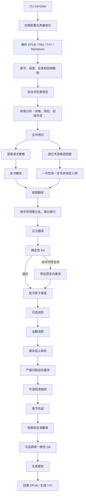

# 翻译工具整体链路与优化判断

> 日期：2026-08-15
> 项目：wenyi / `trans-novel`
> 目标：梳理当前从输入解析到成品导出的完整翻译链路，说明各质量档位的实际行为，并按正确性、成本、时延和维护性给出优化优先级。

## 1. 整体判断

当前工具已经不是简单的“分段调用模型”，而是一条完整的长篇翻译生产线：

```text
结构解析
→ 全书预扫
→ 统一定名
→ 批次翻译
→ 确定性检查
→ 润色 / 去翻译腔
→ 章末审校
→ 跨章 QA
→ 原格式回填
```

现有设计的主要长项：

- EPUB、FB2、TXT、Markdown 统一进入 `Document → Chapter → Segment` 数据模型；
- 受约束的声明式工作流已取代单体 `Orchestrator`，节点定义、计划、执行和组合根职责分离；
- V2 类型化运行状态集中保存运行身份、章节进度、节点生命周期和失败原因；
- 源文件、解析 schema、语言、语义配置和实际模型路由均参与身份或节点指纹校验；
- 批次级断点续跑，已完成批次不会重复翻译；翻译、润色和去翻译腔均使用具备崩溃一致性的检查点；
- 正式导出必须通过针对运行身份、章节完整度、恢复标记和必需上游节点的门禁检查；
- 必需节点不会把 Provider 调用失败或输出协议错误伪装成“无问题”；失败后可续跑，相关信息会保留在状态、事件或报告中；
- 全书概览、章节梗概、滚动上下文和术语快照共同保证长篇上下文；
- 人物条目锁定后由确定性 lint 强制检查；
- 翻译、润色、去翻译腔和审校都有保守采纳门槛；
- prompt 按“稳定前缀在前、动态内容在后”排列，利用 Provider 前缀缓存；
- 逐章梗概、术语挖掘、润色和部分审校已做并发或流水线重叠；
- Token、调用次数、缓存命中、采纳/拒绝和事件日志已有较细归因。

代码架构治理、运行身份校验、正式导出门禁和失败显式化已经完成。当前最值得优先处理的事项已经转为：

1. 收紧正文翻译异常重试，避免 Provider 重试和业务重试相乘；
2. 用当前实现重新建立成本、质量和时延基线；
3. 在 `quality` 档对润色进行选择性触发；
4. 继续降低 lint 定向重译的误触发率；
5. 将跨章一致性 QA 从摘要抽查改为“全文确定性候选 + LLM 定向核验”；
6. 在不破坏检查点和写回顺序的前提下，让章末质量阶段与下一章首译重叠。

整体判断：**流水线的正确性保障和架构边界已经稳定，不需要继续做结构性重写。下一阶段应以真实样本证明质量阶段的收益，并优先消除仍可能放大调用次数的正文翻译重试。**

---

## 2. 审查范围与证据

### 2.1 主要源码

本次梳理覆盖：

- `trans_novel/cli.py`
- `trans_novel/config.py`
- `trans_novel/ingest/`
- `trans_novel/pipeline/contracts.py` / `definition.py` / `planner.py` / `runner.py`
- `trans_novel/pipeline/bootstrap.py`（生产环境中唯一的组合根）
- `trans_novel/pipeline/nodes/`（prepare/prescan/translate/quality/finish 具体节点）
- `trans_novel/pipeline/runstore.py` / `state.py` / `migration.py` / `checkpoint.py` / `fingerprints.py` / `readiness.py`
- `trans_novel/pipeline/context.py`
- `trans_novel/pipeline/lint.py`
- `trans_novel/glossary/`
- `trans_novel/agents/`
- `trans_novel/assemble/translator.py`
- `trans_novel/assemble/writer.py`
- `trans_novel/assemble/report.py`
- `trans_novel/llm/`
- 相关离线测试。

架构治理后，原 `trans_novel/pipeline/orchestrator.py` 已删除。工作流内核、具体节点、状态迁移、输入指纹和导出门禁分别位于独立模块；本文不再使用单文件行数衡量架构复杂度。

### 2.2 历史运行数据

读取了 `state/` 中三本带 `usage.json` 的历史运行，用于观察阶段成本：

- The Price of Time
- The Psychology of Money
- Thinking, Fast and Slow

三本合计约 2147 万 Token。这些运行都开启了 `polish`，但不完全对应当前 `balanced` 或 `quality` 档位，因此只能作为历史优化基线，不能直接代表当前默认成本。

没有修改 `state/`。

### 2.3 与已有文档的关系

`DOCS/token-and-latency-optimization-review.md` 更聚焦 Token、墙钟时间和已实施的无损并发优化。本文侧重：

- 当前端到端运行链路；
- 状态和失败语义；
- 各质量档位；
- 当前代码中的正确性风险；
- 后续优化的综合优先级。

### 2.4 当前实现验证

架构治理完成后的当前工作树已通过：

```text
ruff format .
ruff check .
pytest
```

结果为 `544 passed`。这些测试覆盖输入解析、V1→V2 迁移、身份和指纹对账、断点续跑、节点规划、质量策略切换、失败传播、正式导出门禁、EPUB/TXT 回填以及 CLI 行为。

---

## 3. 当前完整流程



主入口位于 `trans_novel/cli.py:_translate_impl()`，连续流程为：

```text
Application.run_all()
→ run_goal()（受约束的声明式目标，替代旧 run_steps 隐式步骤集）
→ runner 按计划执行：
   prepare（解析/语言/身份/暂存）
   → analyze（风格分析+术语播种）
   → [digest ∥ mine_terms]（并行预扫）
   → name_terms（一次性定名）
   → book_synopsis（全书概览）
   → 逐章 translate/polish/naturalize/review/backtranslate
   → titles → consistency_qa → report → assemble
```

计划由 `planner.py` 从 `ExecutionGoal`、质量策略以及持久化 `NodeState`/输入指纹计算：
已满足的节点不进计划；配置、模型路由或上游产物变化时，只会使受影响的节点及其
所有下游节点失效；禁用的可选节点会以明确的 `skipped` 状态持久化，必须节点不可
禁用。工作流只注册内置节点 id，不支持任意 DAG、Python 导入路径或插件加载。

### 3.1 CLI 与配置展开

`translate` 命令负责：

- 检查输入文件；
- 加载 `config.yaml`；
- 应用 `--quality`；
- 应用源语言、附属章、敬称、润色、QA 和输出覆盖项；
- 创建 `Application`（`pipeline/bootstrap.py` 组合根，唯一构造具体 Agent/节点）；
- 按 ExecutionGoal 执行准备、单章调试或完整翻译；
- 打印完成统计、Token 用量和输出路径。

用户配置只公开：

- Provider；
- `primary` / `fast` 两个模型角色；
- `economy` / `balanced` / `quality` 质量档位。

切分、重试、上下文、并发和各 Agent 路由由内部策略控制。

### 3.2 输入解析与切分

`trans_novel/ingest/segmenter.py:load_document()` 按扩展名分发：

- EPUB → `epub_reader`；
- FB2 → `fb2_reader`；
- TXT / Markdown → `text_reader`。

解析后统一为：

```text
Document
  └── Chapter[]
        └── Segment[]
```

每个 `Segment` 保存：

- 原文 `source`；
- 译文 `target`；
- 类型 `text` / `heading`；
- EPUB 回填锚点；
- 所属 XHTML 资源；
- 超长段续接标记 `cont`；
- 扩展元数据。

当前内部切分阈值：

- 单段最多约 1200 字符；
- 每批最多约 1800 字符。

超长段先按句拆分；导出时通过 `cont` 合回原段。

### 3.3 V2 状态、迁移与断点续跑

每本书的运行状态位于：

```text
state/<book-slug>/
  manifest.json              V2 RunState 根状态
  chapters_v2/ch<n>.json     当前章节数据
  chapters/                  V1 章节备份，迁移后不再读取
  context.json
  analysis.json
  glossary.db
  report.json
  usage.json
  events.jsonl
  resource_templates.json
  journal.json               仅在批次两阶段提交期间存在
```

`manifest.json` 中的 V2 `RunState` 是流水线进度的唯一权威来源：

- `RunIdentity`：源文件 SHA-256、运行输入 schema 版本、归一化后的源语言和目标语言；
- `ChapterProgress`：章节状态、逐章梗概、待润色批次、去腔标记、审校和回译问题；
- `NodeState`：`pending/running/succeeded/skipped/failed_retryable/failed_permanent`、尝试次数、输入指纹、失败原因、时间戳和需跨调用保留的节点输出；
- `AnalysisFlags`：全书级完成标记；`analysis.json` 只保存分析产物。

状态层具备：

- 书级文件锁；进入锁后先执行一次性 V1→V2 迁移、中断恢复和检查点恢复；
- V1→V2 迁移会先写入并校验 `chapters_v2`，最后原子切换根 `manifest.json`；切换后不再保留兼容两种 schema 的运行分支；
- 临时文件加 `os.replace()` 的 JSON 原子写入；
- `running` 节点在进程中断后恢复为可续跑状态，并记录 `interrupted`；
- 翻译、润色和去翻译腔通过 `journal.json` 协调章节内容与进度标记的两阶段提交；
- 每批翻译完成后立即保存，已翻译批次续跑时跳过，并重新构建滚动上下文；
- Provider、模型角色、节点直接使用的语义配置和上游产物都会纳入节点输入指纹；指纹失配时，只清理该节点及其所有下游节点；
- 全书 Token、节点结果和事件增量落盘。

当前正文断点粒度是批次级；节点状态在更高层描述计划执行、失败处理和策略切换。

### 3.4 语言识别与样章分析

新任务在 `source_lang=auto` 时调用模型识别源语言。识别失败会要求用户显式传入 `--source-language`，不会盲猜。

随后从书籍开头、中部和结尾采样，生成：

- 叙事视角；
- 文体和语域；
- 句式风格；
- 角色信息；
- 初始术语。

分析结果写入 `analysis.json`，初始术语种入 SQLite 术语库。

### 3.5 全书预扫与统一定名

开启 `book_understanding` 后执行两条可重叠分支。

#### 分支 A：全书理解

- 每章源文生成梗概；
- 梗概逐章增量落盘；
- 按原章节顺序聚合；
- 生成全书概览；
- 全书概览和本章梗概注入正文翻译。

#### 分支 B：术语候选与定名

当前真实实现：

- 英文：确定性大写词统计与逐章 LLM 候选挖掘合并；
- 其他语言：逐章 LLM 候选挖掘；
- 候选按字符预算分组；
- 定名 Agent 根据风格、章节梗概和已有术语给出唯一中文译名；
- 人物条目标记为锁定状态；
- 定名结果写入 `glossary.db`。

这里存在文档漂移：README 写的是“英文走确定性统计”，但 `trans_novel/glossary/miner.py:424-440` 当前实现是“确定性通道 + LLM 通道”。需要明确预期并同步文档或代码。

### 3.6 正文批次翻译

章节顺序处理；章内批次严格串行，因为后一批需要最近译文作为滚动上下文。

每批提示词包含：

1. 风格指南；
2. 全书概览；
3. 本章梗概；
4. 本章相关术语快照；
5. 最近若干段译文；
6. 当前待译源文。

模板把稳定内容放在动态内容之前，以提高 Provider 前缀缓存命中率。相关块顺序已有测试保护。

模型必须返回等长 JSON 数组：

```json
{
  "translations": ["第 0 段译文", "第 1 段译文"]
}
```

返回数量不符时：

1. 整批重试；
2. 达到上限后逐段翻译兜底；
3. 任一单段仍失败则中断；
4. 不使用空字符串占位，避免错误地把章节标成完成。

### 3.7 确定性 lint 与定向重译

每个首译批次执行零模型成本检查：

- 直接引语是否丢失引号；
- 数字是否缺失或漂移；
- 锁定专名是否按固定译法出现；
- 是否整段未译；
- 长度是否异常。

处理策略：

- 引号、数字、锁定专名和未译属于可自动修复项；
- 长度异常只记录，不直接重译；
- 同批多个问题段优先合并为一次定向重译；
- 合并调用失败时逐段兜底；
- 重译后 lint 问题数必须严格减少才采纳；
- 未通过采纳条件时保留原译，并将问题写入报告。

### 3.8 润色

`polish` 当前只在 `quality` 档默认开启。

处理方式：

- 每个翻译批次落盘后，把润色任务提交到后台线程池；
- 下一批正文翻译不等待润色；
- 章末统一排干本章润色任务；
- 续跑时会重新提交遗留的待润色批次；
- 润色结果若引入新的 lint 类型，该段回退到润色前版本；
- 每批写回后立即清理对应的待润色标记并落盘；
- Provider 调用失败或输出协议错误会保留待润色标记并让节点进入失败状态，续跑时补做；只有本地 lint 质量门拒绝润色结果时才回退到润色前译文。

### 3.9 去翻译腔

`balanced` 和 `quality` 默认开启 `naturalize`。

流程：

1. 批量单语筛查疑似翻译腔段落；
2. 对命中段落单语改写；
3. 确定性 lint，防止引入专名、数字和引号问题；
4. 双语忠实度检查；
5. 原译 / 改写按正反顺序各判断一次；
6. 两次判断都认为改写更好，才正式采纳。

一个疑似段落最多产生：

- 1 次改写；
- 1 次忠实度检查；
- 2 次成对判断。

该阶段质量门槛保守，但单个命中段的调用链较长。

去翻译腔的章节改写和 `naturalized` 标记也通过两阶段检查点提交：若进程在写入改写后、写入标记前崩溃，恢复逻辑会补齐标记而不是重复改写。

### 3.10 章末审校与严重项修复

`balanced` 和 `quality` 默认开启：

- 整章按约三倍翻译批次预算切块；
- 第一块先完成，用于预热前缀缓存；
- 后续块并发审校；
- 协议错误时递归拆小块；
- 检查漏译、误译、增译、专名、人称等语义问题；
- 严重问题使用局部前后文定向重译；
- 新译必须非空并通过长度检查才采纳。

### 3.11 回译抽检

`quality` 默认对约 5% 的段落做回译检查。该阶段从润色、规范化和去腔后的最终译文中随机抽样，问题写入 `ChapterProgress`，并由报告汇总。

### 3.12 标题、QA、报告与正式导出

全部章节完成后：

1. 翻译章节标题和 EPUB 目录项；
2. 按质量策略决定是否执行跨章一致性 QA；
3. 汇总术语冲突、低置信度术语、lint、review、回译问题和失败节点；
4. 保存 `report.json`，并将 QA 问题作为节点输出持久化，支持 `tools qa` 与 `tools report` 跨调用衔接；
5. 正式导出前核验源文件身份、章节状态、所有正文段的 `target` 字段、`pending` 标记以及适用的必需上游节点；
6. 生成纯中文版和/或双语版；
7. EPUB 尽量保留原目录、资源、样式和 XHTML 结构；TXT 按章重新生成。

任何正式 `run_all` 或 `tools assemble` 路径都必须通过同一 `readiness` 门禁。不完整状态会明确拒绝，不再利用 `writer` 的原文回退逻辑生成中外文混合成品；当前没有 `--allow-incomplete` 旁路。

当前跨章一致性 QA 每章只取：

- 前 3 段；
- 后 2 段；
- 总计最多约 600 字符。

因此它仍是摘要级抽查，不是全文一致性扫描。

---

## 4. 模型路由与质量档位

### 4.1 模型路由

当前只向用户公开两个模型角色：

- `primary`：正文翻译、编辑、分析和定名；
- `fast`：审校、预扫、语言识别和附属章粗翻。

内部 Agent 映射：

| 模型角色 | Agent |
|---|---|
| `primary` | `translator`、`editor`、`analyst` |
| `fast` | `reviewer`、`preparer`、`light-translator` |

节点输入指纹只记录节点实际使用的模型角色：正文翻译、润色、样章分析、定名和标题使用 `primary`；预扫、审校、回译和一致性 QA 使用 `fast`；去翻译腔会同时调用两类角色，因此使用组合指纹。切换某个模型时，只会使实际使用该角色的节点及其下游节点失效。

### 4.2 质量档位

依据 `trans_novel/config.py:125-183`：

| 阶段 | economy | balanced 默认 | quality |
|---|---:|---:|---:|
| 样章风格分析 | 开 | 开 | 开 |
| 全书预扫 | 关 | 开 | 开 |
| 一次性定名 | 随预扫关闭 | 开 | 开 |
| 批次 lint | 开 | 开 | 开 |
| 章末审校 | 关 | 开 | 开 |
| 严重项自动重译 | 关 | 开 | 开 |
| 去翻译腔 | 关 | 开 | 开 |
| 全文润色 | 关 | 关 | 开 |
| 跨章一致性 QA | 关 | 关 | 开 |
| 回译抽检 | 0 | 0 | 5% |

当前默认 `balanced` 已经关闭全文润色，只保留预扫、定名、lint、去翻译腔、章末审校和严重项自动修复。

---

## 5. 当前值得保留的设计

### 5.1 批次级断点续跑

这是长书任务最重要的基础能力。翻译、pending 润色、异步审校和用量都会增量落盘，不应为简化代码退回章级 checkpoint。

### 5.2 原子状态写入与运行锁

`RunStore` 的临时文件替换和书级进程锁有效防止半写 JSON 和并发写坏状态，应保留。

### 5.3 提示词前缀缓存布局

风格、全书概览和章节梗概位于动态术语、滚动上下文和待译正文之前。后续做 prompt 优化时不能随意破坏这一顺序。

### 5.4 章内翻译串行

章内后一批依赖前一批译文，直接并行会破坏代词、称谓、句意衔接和人物语气。不能把章内批次并行宣称为无损优化。

### 5.5 确定性门禁优先

引号、数字、锁定专名和未译检查不消耗 Token，而且给定向重译提供明确反馈。后续应提升精度，而不是删除该层。

### 5.6 保守采纳

- lint fix 必须减少问题数；
- 润色不能引入新 lint 类型；
- 去腔必须通过 lint、忠实度和双顺序判断；
- 严重项重译必须非空并通过长度检查。

这些门槛限制了二次加工“越修越坏”的风险。

### 5.7 主线程统一持久化

当前线程池主要执行 LLM 调用，SQLite 和 RunStore 写入留在主线程。这降低了线程安全和崩溃恢复复杂度，应继续作为并发改造的约束。

---

## 6. 历史成本基线

三个带 operation 归因的历史运行合计约 2147 万 Token：

| 阶段 | Token | 占比 |
|---|---:|---:|
| `translate.batch` | 7,221,763 | 33.6% |
| `polish.batch` | 6,576,556 | 30.6% |
| `translate.lint_fix` | 2,992,877 | 13.9% |
| `review.chapter` | 2,318,046 | 10.8% |
| 术语挖掘和定名 | 1,221,616 | 5.7% |
| Naturalizer 全部环节 | 886,839 | 4.1% |
| 其他 | 约 254,000 | 约 1.3% |

注意：这些历史运行开启了润色，但没有完整覆盖当前 `quality` 的所有阶段，不能视为当前质量档位的精确账单。

### 6.1 润色成本

历史样本中，润色消耗约 30.6% 总 Token，接近再次处理一遍正文。

约 98% 的润色结果通过了“没有引入新 lint 类型”的门禁，但这个 accepted 只代表没有检测到确定性回归，不代表文学质量一定显著提升。

因此，润色是最大成本杠杆，但不能仅凭 Token 占比直接关闭；应先衡量真实质量增益。

### 6.2 lint fix 成本

历史样本中：

- lint fix 占总 Token 约 13.9%；
- 提议修复约 39.6% 未被采纳；
- 按历史比例粗略折算，被拒绝的 lint fix 对应约 118 万 Token，即总量约 5.5%。

当前 `lint.py` 已加入部分译名、人名句首歧义、标识符等豁免规则，历史拒绝率可能高于当前版本。需要用当前代码重建基线后再决定阈值。

### 6.3 章末审校与去翻译腔

历史样本中：

- 章末审校约占 10.8%；
- 去翻译腔全部环节约占 4.1%。

Naturalizer 的总体成本低于润色和 lint fix，但每个疑似段落可能触发四次模型调用，适合做时延流水线优化，不是首要 Token 优化对象。

---

## 7. P0：正确性和运行可靠性状态

### 7.1 已完成：运行身份与节点输入指纹

状态目录仍使用 `state/<book-slug>`，但目录名不再是续跑身份。`RunIdentity` 会校验：

```text
sha256(source bytes)
+ run input schema version
+ normalized source language
+ normalized target language
```

同名书、替换过的源文件、解析输入契约变化或语言变化会在复用翻译和回填模板前抛出 `IdentityMismatchError`，不会静默续跑。

每个使用 LLM 或配置的节点都有独立的输入指纹，覆盖其实际使用的：

- 源文或上游持久化产物；
- 会改变该节点语义的配置；
- Provider 及节点实际使用的 `primary` / `fast` 模型角色；
- 一致性 QA 使用的完整术语语义，而不只是 `source` 字段的拼写；
- `assemble` 的输出格式、单双语开关和双语顺序。

指纹失配会沿固定依赖图向下游传播，使后代节点失效。质量档位、批次预算等与首译无关的变化不会清空已确认译文；启用此前跳过的润色、去腔、审校或 QA 时，只补做相应节点。V1 迁移生成的成功节点会在第一次 V2 规划时原子建立指纹基线，后续配置变化同样参与对账。

### 7.2 已完成：正式导出完整性门禁

`run_all`、独立 `tools assemble` 和由 `writer` 执行的正式回填统一调用 `ensure_assemble_ready()`。门禁检查：

- 当前源文件与运行身份一致；
- 所有章节为 `done`；
- 所有正文段都有非空的 `target` 字段；
- 无 `pending_polish` 或 `review_pending`；
- `prepare`、`analyze`、`translate`、`titles`、`report` 及其他适用必需节点已成功；
- 不存在失败且尚未处理的必需节点；明确采用尽力而为策略的 `mine_terms` / `name_terms` 节点除外。

不满足条件时抛出 `ReadinessError` 并列出全部问题。当前不提供不完整成品预览开关，因此不会将原文回退逻辑作为正式产出语义。

### 7.3 已完成：失败状态和严格输出协议

工作流对失败进行稳定分类：

```text
protocol
provider_retryable
provider_permanent
business
interrupted
```

必需节点调用 Agent 时会走严格校验路径，拒绝非法 JSON、缺失键、`null`、错误集合类型、集合中的非对象元素、段数不符和空标题等输出协议错误。成功返回空列表仍表示“模型成功判断无问题”；Provider 调用失败或输出协议错误则记录到 `NodeFailure`，不会伪装成空结果。

节点生命周期明确区分：

```text
pending
running
succeeded
skipped
failed_retryable
failed_permanent
```

禁用的可选阶段记录为 `skipped`。启用的润色、去翻译腔、审校、QA 等必需节点失败时不会被记为成功，也不能通过正式导出门禁；只有 `mine_terms` 和 `name_terms` 明确采用尽力而为策略，这些节点失败后仍可继续正文翻译，但失败信息会保留在状态、事件和报告中。

### 7.4 仍待完成：收紧正文翻译异常捕获范围

底层 Provider 传输层已经会对可重试的网络错误重试多次，但 `Translator.translate_batch()` 目前仍捕获所有 `Exception`：

1. 整批重复多次；
2. 再逐段调用兜底。

这对 JSON 解析、空译文和段数不对齐等协议错误合理；对认证失败、配置错误和服务永久拒绝会放大请求数及等待时间。

最坏情况下，一个逻辑批次可能形成：

```text
多次整批调用 × 每次 Provider 重试
+ N 次逐段调用 × 每次 Provider 重试
```

下一步应：

- 只对输出协议错误执行整批或逐段恢复；
- Provider 永久错误立即冒泡；
- Provider 可重试错误只由底层传输层处理，避免业务层再次放大重试次数。

---

## 8. P1：成本和时延优化

### 8.1 `quality` 档改为选择性润色

当前 `balanced` 已默认关闭润色，这一决策合理。

对于 `quality`，不建议未经验证直接取消润色，而应从“全批润色”改为“筛选后润色”：

- 使用 reviewer 的文体问题作为触发条件；
- 或先由 fast 模型筛选确实需要润色的批次；
- 长度、对白、叙述类型可作为确定性候选特征；
- 已自然、短小或高度结构化的段落直接跳过。

历史成本上限约为总 Token 的 30.6%，这是最大的单项成本杠杆。

上线前必须在固定真实章节上 A/B 比较：

- 人工盲评；
- 润色采纳率；
- 语义回归率；
- 每千字 Token；
- 总耗时。

### 8.2 按 lint 类型分别优化触发精度

不应把所有 lint fix 作为同一类统计。

建议用量和报告直接输出：

```text
每种 lint：
  命中数
  触发重译数
  采纳数
  拒绝数
  Token
  最终仍未解决数
```

触发策略：

- 引号丢失：高确定性，继续自动修；
- 整段未译：高确定性，继续自动修；
- 锁定专名：先排除简称、姓氏、省略和普通词歧义；
- 数字：区分真实数量、编号、年代、范围、标识符和排版噪声。

目标不是减少 lint，而是减少“不会被采纳的 LLM 修复调用”。

### 8.3 让章末质量阶段与下一章首译重叠

当前已经后台化：

- 批次润色；
- 部分异步审校；
- 预扫和术语挖掘。

但 `balanced` / `quality` 的严重项自动修复仍使章末审校位于关键路径，去翻译腔也同步阻塞下一章。

可考虑：

```text
主线程：翻译第 N+1 章
后台：第 N 章去腔 / review
主线程：统一写回后台结果
```

[INFERENCE] 当前滚动上下文使用的也不是去腔和章末重译后的最终版本，因此将这些阶段后移通常不会额外改变现有上下文语义。但必须先验证：

- 章节完成状态；
- 写回顺序；
- 结果采纳；
- 进程中断；
- 续跑补做。

这项主要降低墙钟时间，不降低 Token。

### 8.4 收敛英文术语挖掘策略

当前英文实际走“确定性 + 逐章 LLM”，README 与代码不一致。

可选策略：

- 成本优先：英文只做确定性候选，LLM 负责过滤和定名；
- 召回优先：只对确定性规则低覆盖的章节补跑 LLM；
- 质量优先：保留双通道，并同步 README。

历史上 term mine 本身约占 0.8%，不是第一优先级。定名和挖掘合计约 5.7%，更值得检查的是多个定名分组重复携带全书摘要造成的 prompt 成本。

---

## 9. P1：质量有效性

### 9.1 重做跨章一致性 QA 的覆盖方式

当前一致性 QA 每章只看首三段、末两段和最多约 600 字符，无法可靠发现：

- 章节中部的人名译法漂移；
- 人称和性别在中段变化；
- 同一概念在不同位置被译成不同词；
- 角色语气中途漂移。

建议改为两阶段：

#### 阶段一：确定性全文扫描

- 全文扫描 `source` / `target`；
- 检查译文是否采用已锁定术语的固定译法；
- 查同源多译和别名漂移；
- 输出具体章节和段号；
- 生成待核验候选。

#### 阶段二：LLM 定向核验

- 只提交候选问题和局部上下文；
- 人称、语气等无法由规则判断的问题按章节块检查；
- 结果必须能定位到具体段落。

这比“整本书摘要一次问模型”更可解释，也不会造成已经覆盖全文的错觉。

---

## 10. 架构治理结果与剩余维护成本

### 10.1 已完成：受约束的声明式工作流取代单体 `Orchestrator`

原单体 `Orchestrator` 已删除，当前依赖方向为：

```text
CLI
→ Application / bootstrap 组合根
→ WorkflowDefinition + Planner + WorkflowRunner
→ WorkflowNode
→ RunRepository
```

- `contracts.py`：作用域、失败策略、节点协议、`RunRepository` 协议和 `ExecutionGoal`；
- `definition.py`：不可变 `NodeSpec` 与固定 `WorkflowDefinition`，校验是否存在重复节点、未知或缺失的依赖、依赖环以及非法作用域边；
- `planner.py`：从执行目标、质量策略、持久化节点状态和输入指纹生成确定性计划，显式处理章节级扇出、全书级扇入、动作根、策略切换和向下游传播的失效；
- `runner.py`：持有运行锁，执行节点生命周期、并发任务汇合、主线程提交、失败分类、异步收尾、章节完成和用量落盘；
- `bootstrap.py`：生产环境中唯一的组合根，按解析后的语言对构造 Agent、节点和仓库实现，并组装工作流；
- `nodes/`：承载具体业务逻辑，不反向承担计划或全局状态机职责。

配置只能引用已注册的内置节点 id；不支持任意 YAML DAG、Python 导入路径或插件加载。节点按独立输入、检查点和失败语义划分，而不是机械地让每个 Agent 对应一个节点：

```text
prepare → analyze
prepare → digest* ∥ mine_terms
analyze + digest* + mine_terms → name_terms
digest* + name_terms → book_synopsis
book_synopsis → translate* → polish* → naturalize* → review* / backtranslate*
chapter barrier → titles → consistency_qa → report → assemble
```

批内 lint、术语抽取留在翻译节点内；严重项自动重译留在审校节点内；附属章旁路是翻译节点内部策略，不复制子图。

### 10.2 已完成：状态归属、迁移和崩溃恢复边界

- `RunState` 是运行进度的唯一权威来源；`Chapter.meta` 只保存 `ingest`、EPUB 和 FB2 元数据；
- `ChapterProgress` 保存章节流水线状态，`NodeState` 保存节点生命周期、失败和指纹；
- V1 迁移在书级锁内一次完成，最后切换根 `manifest`，运行时不保留兼容两种 schema 的分支；
- 工作线程只做 LLM 计算；并行节点的 `commit` 由 `runner` 在主线程按确定顺序执行，提交成功后才将节点标记为成功；
- 翻译、润色和去腔使用检查点日志保护跨文件写入；
- 异步审校任务与节点的 `finish` 方法共享同一失败记录与恢复路径；
- 正式导出通过独立的 `readiness` 模块检查，不由 `writer` 猜测状态是否完整。

### 10.3 剩余项：缩减重复事件日志和全章重写

当前每个批次会保存整章 JSON，并在 `events.jsonl` 记录翻译或改写信息。历史单本书事件日志约 1.6–9.1 MB，目前不构成主要瓶颈，但数据存在重复。

可逐步调整：

- 常规 `batch_translated` 只记录章节、起点、数量和摘要哈希；
- 真正发生改写时才保存修改前后的内容；
- 全量译文只保留在章节状态文件中；
- 只有测得长书的磁盘读写成为瓶颈后，再考虑批次日志和章末压实。

---

## 11. 推荐实施顺序

### 已完成：架构与正确性基础

1. V2 类型化状态与锁内 V1 迁移；
2. 运行身份、节点输入指纹和传递失效；
3. 正式导出完整性门禁；
4. 失败分类、严格输出协议和可续跑节点生命周期；
5. 受约束的声明式工作流与组合根，删除单体 `Orchestrator`；
6. 翻译、润色、去腔和异步审校的崩溃恢复路径。

### 下一阶段：收紧重试并建立当前版本基线

先按失败类型收紧 `Translator.translate_batch()` 的业务重试，避免 Provider 重试与整批/逐段兜底相乘。随后固定 2–3 个代表性章节：

- 小说对白；
- 非虚构数字密集文本；
- 大量人名和机构名文本。

记录：

- 每阶段 Token 和墙钟时间；
- 逻辑调用次数与实际尝试次数；
- 各类 lint 的命中、采纳和拒绝次数；
- `polish` / `naturalize` 实际改写率；
- `review` 严重问题修复率；
- 人工盲评结果。

历史 `state/` 数据可以参考，但当前状态、失败和质量阶段语义已经变化，不能直接作为新版本结论。

### 后续阶段：优化成本和时延

1. 选择性润色；
2. 分别收紧术语和数字 lint 的触发条件；
3. 让去翻译腔、审校与下一章首译重叠执行；
4. 收敛英文术语挖掘策略。

### 后续阶段：提高 QA 覆盖

1. 用确定性规则扫描全文，生成一致性问题候选；
2. 使用 LLM 对候选定向核验；
3. 让结果定位到章节和段落，并保持可续跑、可报告。

---

## 12. 验证原则

任何成本或时延优化都不能只看 Token。至少需要验证：

### 12.1 确定性正确性

- 输入段数与输出段数一致；
- 引号、数字和锁定专名不回归；
- 超长段能够正确合回；
- EPUB 目录、锚点、资源和 XHTML 不损坏；
- 中断后续跑不重复已完成工作；
- 同名书和源文件变化不能误复用状态；
- 未完成任务不能默认导出正式成品；
- V1→V2 迁移可在中断后恢复；迁移产物也会参与指纹校验，后续配置或模型变更时能正确触发失效；
- 只改变 `primary` 或 `fast` 时，仅重跑实际使用该模型角色的节点及其后代；
- 必需节点失败、处于 `pending` 状态或缺失时，必须拒绝正式导出。

### 12.2 模型质量

在固定真实章节上盲评：

- 忠实度；
- 漏译和增译；
- 人名与术语一致性；
- 中文自然度；
- 角色口吻；
- 段间和章间连贯性。

### 12.3 成本与性能

- prompt Token；
- completion Token；
- reasoning Token；
- 缓存命中；
- 逻辑调用次数与实际尝试次数；
- 首 Token 和总请求耗时；
- 每阶段墙钟时间；
- 每千字 Token 和耗时；
- 自动修复采纳率和拒绝率。

### 12.4 上线门槛

- 正确性门禁必须全部通过；
- 质量指标不能仅凭单模型自评；
- Token 优化必须在真实章节上证明收益；
- 调度优化必须验证崩溃恢复和状态写回；
- 失败阶段必须在报告和续跑状态中可见。

---

## 13. 最终建议

架构治理已经完成，不应继续围绕 `Orchestrator` 拆分或再引入一套执行框架。下一步直接做：

1. **正文异常重试分类**：只对输出协议错误执行整批/逐段恢复，避免与 Provider 重试相乘；
2. **当前版本基线**：用固定真实章节重新测量 Token、时延、逻辑调用次数、实际尝试次数、采纳率和人工质量；
3. **`quality` 选择性润色**：优先减少当前最大成本阶段中收益不明确的调用；
4. **lint 分规则评估**：按规则统计命中、调用、采纳、拒绝和最终未解决数；
5. **全文一致性候选扫描**：用确定性规则扫描全文并生成候选，避免摘要级“全书 QA”造成已经覆盖全文的错觉；
6. **章间流水线重叠**：在验证检查点、主线程写回和中断恢复后，再让下一章首译与上一章质量阶段并发执行。

运行身份、输入指纹、正式导出门禁和失败显式化已经是当前实现，不再列为未来建议。后续优化必须建立在这些契约之上，不能通过放宽门禁、吞掉失败或恢复原文回退逻辑来换取表面成功率。

最终方向应是：**保留现有长篇理解、一致性、保守采纳和可恢复执行能力，用真实基线决定高成本质量阶段的去留，并让每次失败、重跑和质量收益都可观测、可比较。**
